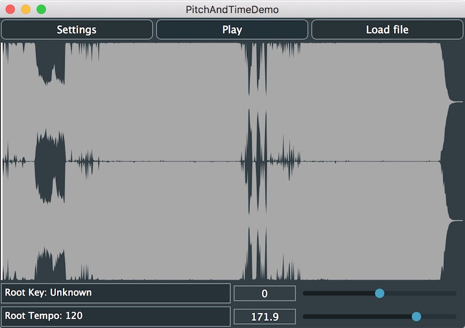

# 02 - PitchAndTimeDemo

In this tutorial, we're going to build a quick retune and tempo-adjust app which could be used to learn to play complex music at a slower rate or to adjust the key of a song to fit your guitar tuning or vocal range.


## PitchAndTimeComponent.h
If you open the PitchAndTimeComponent.h file you'll see it's a JUCE PIP. You can use the Projucer to create a project to build the PIP or use the script in `/tests` to generate one automatically.

#### PitchAndTimeComponent Class
The PitchAndTimeComponent is defined similarly to the PlaybackDemo class.
```
class PitchAndTimeComponent   : public Component,
                                private ChangeListener
```

#### Private Members
- If you look in the private members section of the `PitchAndTimeComponent` again, you'll see similarities with the PlaybackDemo: There's an `Engine` to setup the Tracktion Engine, and an `Edit`. However, this time the `Edit` is a member which we create as an empty Edit, ready for editing.
```
te::Edit edit { engine, te::createEmptyEdit(), te::Edit::forEditing, nullptr, 0 };
```

- For speed, the next line take a reference to the `Edit`'s `TransportControl`.
```
te::TransportControl& transport { edit.getTransport() };
```

- The next few members are simply standard JUCE Components which we'll set up in the constructor.
The one exception to this is the `Thumbnail` which is a custom Component which you can find in the `common/Utilities.h` folder. It's fairly simple and just shows a file's thumbnail and a draggable transport position.
```
FileChooser audioFileChooser { "Please select an audio file to load...",
                               engine.getPropertyStorage().getDefaultLoadSaveDirectory ("pitchAndTimeExample"),
                               engine.getAudioFileFormatManager().readFormatManager.getWildcardForAllFormats() };
TextButton settingsButton { "Settings" }, playPauseButton { "Play" }, loadFileButton { "Load file" };
Thumbnail thumbnail { transport };
TextEditor rootNoteEditor, rootTempoEditor;
Slider keySlider, tempoSlider;
```

#### `PitchAndTimeComponent()` Constructor
- In the constructor, we'll first add ourselves as a ChangeListener to the transport to be notified of when play stops and starts then update the play button text. Then we'll use our `addAndMakeVisible` helper to add all of our child Components in one go.
```
transport.addChangeListener (this);
updatePlayButtonText();
Helpers::addAndMakeVisible (*this,
                            { &settingsButton, &playPauseButton, &loadFileButton, &thumbnail,
                              &rootNoteEditor, &rootTempoEditor, &keySlider, &tempoSlider });
```
- Next, we'll set up some `onClick` handlers for our top buttons.
```
settingsButton.onClick  = [this] { EngineHelpers::showAudioDeviceSettings (engine); };
playPauseButton.onClick = [this] { EngineHelpers::togglePlay (edit); };
loadFileButton.onClick  = [this] { EngineHelpers::browseForAudioFile (engine, [this] (const File& f) { setFile (f); }); };
```
- Some focus lost handlers for our labels
```
rootNoteEditor.onFocusLost = [this] { updateTempoAndKey(); };
rootTempoEditor.onFocusLost = [this] { updateTempoAndKey(); };
```
- And similarly, some drag handlers for our sliders. Note that we're only updating the tempo and key when the slider drag ends to avoid constantly triggering proxy file refreshes.
```
keySlider.setRange (-12.0, 12.0, 1.0);
keySlider.onDragEnd = [this] { updateTempoAndKey(); };
tempoSlider.setRange (30.0, 220.0, 0.1);
tempoSlider.onDragEnd = [this] { updateTempoAndKey(); };
```
- The last thing we'll do in the constructor is assign a custom text display for our `keySlider`. This effectively appends the note name to the number of semitones the slider is set to.
```
keySlider.textFromValueFunction = [this] (double v)
                                  {
                                      const int numSemitones = roundToInt (v);
                                      const auto semitonesText = (numSemitones > 0 ? "+" : "") + String (numSemitones);

                                      if (auto clip = getClip())
                                      {
                                          const auto audioFileInfo = te::AudioFile (clip->getSourceFileReference().getFile()).getInfo();
                                          const auto rootNote = audioFileInfo.loopInfo.getRootNote();

                                          if (rootNote <= 0)
                                              return semitonesText;

                                          return semitonesText + " (" + MidiMessage::getMidiNoteName (rootNote + numSemitones, true, false, 3) + ")";
                                      }

                                      return semitonesText;
                                  };
```

#### `resized()` Callback
The `resized` callback is straightforward and simply lays out the buttons at the top, `Thumbnail` in the middle, key and tempo `TextEditor`s in the bottom left and the sliders next to them.


#### `getClip()` and `getSourceFile()` Helper methods
```
te::WaveAudioClip::Ptr getClip()
{
    if (auto track = edit.getOrInsertAudioTrackAt (0))
        if (auto clip = dynamic_cast<te::WaveAudioClip*> (track->getClips()[0]))
            return *clip;

    return {};
}
```
`getClip` digs in to the first track and return the first clip from that track.

```
File getSourceFile()
{
    if (auto clip = getClip())
        return clip->getSourceFileReference().getFile();

    return {};
}
```
`getSourceFile` uses that clip to get the `SourceFileReference` it contains and then resolves the file. In this example, because our `Edit` doesn't refer to a file on disk, the path is stored as an absolute path in the `SourceFileReference`.


#### `setFile()` Method
- The setFile method is fairly large so we'll go through it in stages.
```
void setFile (const File& f)
{
    keySlider.setValue (0.0, dontSendNotification);
    tempoSlider.setValue (120.0, dontSendNotification);
```
Firstly, we reset the key and tempo sliders to some default values.
```
    if (auto clip = EngineHelpers::loadAudioFileAsClip (edit, f))
    {
        // Disable auto tempo and pitch, we'll handle these manually
        clip->setAutoTempo (false);
        clip->setAutoPitch (false);
        clip->setTimeStretchMode (te::TimeStretcher::defaultMode);
```
- Next, we use the `loadAudioFileAsClip` helper to clear the track contents, create a new clip and load our file in to it. Next, we disable any settings for auto-tempo and auto-pitch as these sync the clip to the `Edit`'s tempo and pitch sequence, we want manual control over these properties. We also set the time stretch mode to  `TimeStretcher::defaultMode` which will be SoundTouch or Elastique if you have access to the SDK and have enabled it with the module option flag.
```
        thumbnail.setFile (EngineHelpers::loopAroundClip (*clip)->getPlaybackFile());
```
- Next, we ensure our `Thumbnail` component is showing the file that will be played back by the clip and using the `loopAroundClip` helper method we set the loop in/out points to the start/end of the clip. This also resets our transport position and starts playback.
```
        const auto audioFileInfo = te::AudioFile (f).getInfo();
        const auto loopInfo = audioFileInfo.loopInfo;
        const auto tempo = loopInfo.getBpm (audioFileInfo);
        rootNoteEditor.setText (TRANS("Root Key: ") + Helpers::getStringOrDefault (MidiMessage::getMidiNoteName (loopInfo.getRootNote(), true, false, 3), "Unknown"), false);
        rootTempoEditor.setText (TRANS("Root Tempo: ") + Helpers::getStringOrDefault (String (tempo, 2), "Unknown"), false);

        keySlider.setValue (0.0, dontSendNotification);
        keySlider.updateText();

        if (tempo > 0)
            tempoSlider.setValue (tempo, dontSendNotification);
```
- The aim here is to find out the file's tempo and key based on any metadata it might contain and then set the root note and tempo editors to these values. The difference between these and the sliders will then determine how much time and pitch shifting to apply to the clip.<br/><br/>
To get the metadata stored in the file we create an `AudioFile` from it, then get a `LoopInfo` object from it.
The `LoopInfo` contains a cache of any metadata so we can find the tempo using `loopInfo.getBpm (audioFileInfo)` and the root note using `loopInfo.getRootNote()`. Once we've got these we can format the text a bit more appropriately for a user label.<br/><br/>
Finally we reset the key slider to 0 (which indicates no pitch shift) and the tempo slider to the tempo of the file (which indicates no time-stretching).
```
    }
    else
    {
        thumbnail.setFile ({});
        rootNoteEditor.setText (TRANS("Root Key: Unknown"));
        rootTempoEditor.setText (TRANS("Root Tempo:  Unknown"));
    }
}
```
If the file can't be loaded or the clip created for some reason, we simply reset out components to some default values.

#### `updateTempoAndKey()` Method
The `updateTempoAndKey` is where we set the time-stretching and pitch-shifting to be applied to the clip.
- First we get the base tempo which is the value in the root tempo text editor. If the file had tempo metadata, this will be set to the file's tempo otherwise the user may have typed in a value.
- If we have a valid tempo we calculate the speed ratio (amount of time-stretching to apply) by dividing the tempo-slider value (i.e. the target tempo) by the base tempo (the file's tempo). We then set the clip's speed ratio to this.
- We also need to adjust the length of the clip so that it fits the whole time-stretched version of the source file.
- Next we simply set the clip's pitch based on the value from the key slider, this is a number of semitones up and can be negative
- Finally we call `loopAroundClip` to set the loop points to the clip's edges, set the transport looping and reset it to the start of the `Edit`. We also then set the thumbnail to display the _playback file_ of the clip. Doing this gives our thumbnail a chance to show a message as the proxy wav file is created. Showing this file rather than our original source file is also more accurate as time-stretching can change the shape of the waveform.
```
void updateTempoAndKey()
{
    if (auto clip = getClip())
    {
        auto f = getSourceFile();
        const auto audioFileInfo = te::AudioFile (f).getInfo();
        const double baseTempo = rootTempoEditor.getText().retainCharacters ("+-.0123456789").getDoubleValue();

        // First update the tempo based on the ratio between the root tempo and tempo slider value
        if (baseTempo > 0.0)
        {
            const double ratio = tempoSlider.getValue() / baseTempo;
            clip->setSpeedRatio (ratio);
            clip->setLength (audioFileInfo.getLengthInSeconds() / clip->getSpeedRatio(), true);
        }

        // Then update the pitch change based on the slider value
        clip->setPitchChange (float (keySlider.getValue()));

        // Update the thumbnail to show the proxy render progress
        thumbnail.setFile (EngineHelpers::loopAroundClip (*clip)->getPlaybackFile());
    }
}
```

#### Notes
It may seem odd to have different source and playback files however, this is done for speed and flexibility. When playing back clips in an Edit with a complex tempo or pitch sequence, it is much more efficient to generate wav file proxy files which can then be memory mapped and read directly. This enables the OS to handle any prefetching and caching as well as simplifying seek if the source file is a compressed format.

Additionally, there can be complex chains of playback file generation going through `ClipEffects`, reversals and even `EditClip` renders. The final file to playback and preview may be vastly different from the source file!
