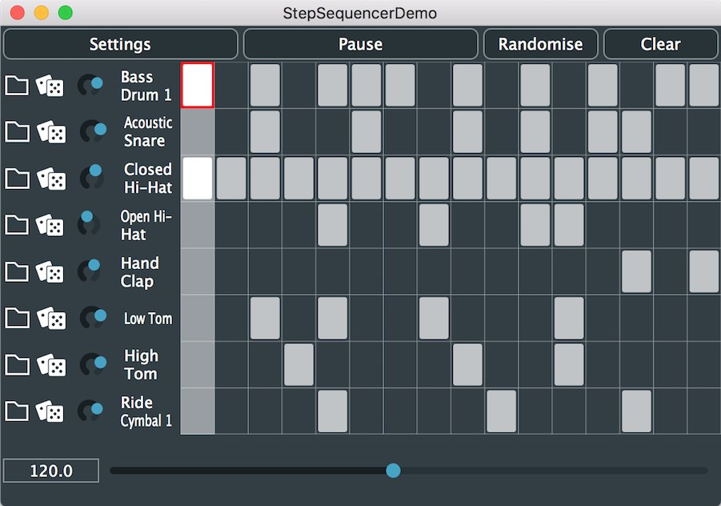

# 03 - StepSequencerDemo

In this tutorial, we're going to build a quick step sequencer playing back audio samples.
The idea here is to use Tracktion Engine's `StepClip` to manage a step sequence which will then send MIDI to a `SamplerPlugin` which will be used to play back audio samples.




## StepSequencerDemo.h
If you open the StepSequencerDemo.h file you'll see it's a JUCE PIP. You can use the Projucer to create a project to build the PIP or use the script in `/tests` to generate one automatically.

Near the top of the file you'll see the `StepEditor` class. This is the main step entry editor. The workings of this are a bit out of scope for this tutorial but the code is there for you to browse. The main idea is that it maps an XY pixel position to the the `StepClip`'s channel and note index. Clicking and dragging then either turns cells on or off depending on the initial value of the cell that was clicked.

The buttons for loading a file, randomising and adjusting volume we will take a look at a little later in this tutorial.

#### StepSequencerDemo Class
The `StepSequencerDemo` is defined similarly to the PitchAndTimeComponent class.
```
class StepSequencerDemo : public Component,
                         private ChangeListener
```

#### Private Members
- Again, the initial private members are the same as the previous tutorial as we'll be creating this `Edit` as a temporary object in memory.
```
te::Engine engine { ProjectInfo::projectName };
te::Edit edit { engine, te::createEmptyEdit(), te::Edit::forEditing, nullptr, 0 };
te::TransportControl& transport { edit.getTransport() };
```

- We then have objects for our buttons, tempo slider and our `StepEditor`.
```
TextButton settingsButton { "Settings" }, playPauseButton { "Play" }, randomiseButton { "Randomise" }, clearButton { "Clear" };
Slider tempoSlider;
std::unique_ptr<StepEditor> stepEditor;
```
> Note that the `StepEditor` is managed via a `std::unique_ptr` as it requires a `StepClip` argument in its constructor so can't be created until after the clip has.

#### `StepSequencerDemo()` Constructor
> Some things in the constructor are the same as the previous demo so again, we'll omit the explanation for these.

- The first thing we do in the constructor is create a step clip which will act as the step.
Next, we use some embedded binary data to create some temporary sample files and pass these to our `createSamplerPlugin` method. These files will be the default samples loaded in to our `SamplerPlugin`. We'll go in to the implementation details of these methods in the next section.
```
createStepClip();
createSamplerPlugin (createSampleFiles());
```
- Next we create our `StepEditor` from the clip we created above, add all our child Components and make them visible and update the play button text.
```
stepEditor = std::make_unique<StepEditor> (*getClip());
Helpers::addAndMakeVisible (*this, { &settingsButton, &playPauseButton, &randomiseButton,
                                     &clearButton, &tempoSlider, stepEditor.get() });
updatePlayButtonText();
```
- As in previous examples, we set up the settings and play buttons to control the engine and transport.
Now we also assign onClick handler to our global randomise and clear buttons. These get the `StepClip` from the `Edit` and simply call the `randomiseSteps` and `clear` helper method of the first `StepClip::Pattern` contained in the clip.
```
settingsButton.onClick  = [this] { EngineHelpers::showAudioDeviceSettings (engine); };
playPauseButton.onClick = [this] { EngineHelpers::togglePlay (edit); };
randomiseButton.onClick = [this] { getClip()->getPattern (0).randomiseSteps(); };
clearButton.onClick     = [this] { getClip()->getPattern (0).clear(); };
```
- Finally we need to configure our tempo slider. We'll set a sensible range for this between 30 and 220. We'll then refer the slider's internal Value object to our `TempoSequence`'s first `TempoSetting` `bpm` property. This effectively binds the slider to the tempo's `ValueTree` property. Simple!
```
tempoSlider.setRange (30.0, 220.0, 0.1);
tempoSlider.getValueObject().referTo (edit.tempoSequence.getTempos()[0]->bpm.getPropertyAsValue());
```
> The slightly long winded way of getting the tempo here is because you can have multiple tempos in a `TempoSequence` and ramp between them. This can lead to some interesting musical effects or be used to map to audio which wasn't recorded to a click track or constant tempo.


#### `createStepClip()` Method
```
te::StepClip::Ptr createStepClip()
{
    if (auto track = edit.getOrInsertAudioTrackAt (0))
    {
        // Find length of 1 bar
        const te::EditTimeRange editTimeRange (0, edit.tempoSequence.barsBeatsToTime ({ 1, 0.0 }));
        track->insertNewClip (te::TrackItem::Type::step, "Step Clip", editTimeRange, nullptr);

        if (auto stepClip = getClip())
            return EngineHelpers::loopAroundClip (*stepClip);
    }

    return {};
}
```
`createStepClip` gets the first audio track in the `Edit`, uses the `TempoSequence` to find out the time duration in seconds for a single bar, and creates a new `StepClip` with that range.  
Lastly, it uses the `loopAroundClip` helper to set the loop in/out positions as before.

#### `createSampleFiles()` Method
```
Array<File> createSampleFiles()
{
    Array<File> files;
    const auto destDir = edit.getTempDirectory (true);
    jassert (destDir != File());

    using namespace DemoBinaryData;

    for (int i = 0; i < namedResourceListSize; ++i)
    {
        const auto f = destDir.getChildFile (originalFilenames[i]);

        int dataSizeInBytes = 0;
        const char* data = getNamedResource (namedResourceList[i], dataSizeInBytes);
        jassert (data != nullptr);
        f.replaceWithData (data, dataSizeInBytes);
        files.add (f);
    }

    return files;
}
```
`createSampleFiles` gets the temp directory for our `Edit`, iterates all the files in the `DemoBinaryData` and creates concrete files on disk for them. As it does this it adds the file paths to an array and then returns this.
The result is an array of sample files that will be deleted in our app's destructor with the call to `engine.getTemporaryFileManager().getTempDirectory().deleteRecursively();`.


#### `createSamplerPlugin (Array<File> defaultSampleFiles)` Method
- `createSamplerPlugin` takes an array of sample files and creates a `SamplerPlugin` to play each of these back. In order for the `StepClip` to play this back, we use the `StepClip`'s channel note number as the `SamplerPlugin`'s sound parameter. This effectively creates a sound layer with a single note range.
```
void createSamplerPlugin (Array<File> defaultSampleFiles)
{
    if (auto stepClip = getClip())
    {
        if (auto sampler = dynamic_cast<te::SamplerPlugin*> (edit.getPluginCache().createNewPlugin (te::SamplerPlugin::xmlTypeName, {}).get()))
        {
            stepClip->getTrack()->pluginList.insertPlugin (*sampler, 0, nullptr);

            int channelCount = 0;

            for (auto channel : stepClip->getChannels())
            {
                const auto error = sampler->addSound (defaultSampleFiles[channelCount++].getFullPathName(), channel->name.get(), 0.0, 0.0, 1.0f);
                sampler->setSoundParams (sampler->getNumSounds() - 1, channel->noteNumber, channel->noteNumber, channel->noteNumber);
                jassert (error.isEmpty());

                for (auto& pattern : stepClip->getPatterns())
                    pattern.randomiseChannel (channel->getIndex());
            }
        }
    }
    else
    {
        jassertfalse; // StepClip not been created yet?
    }
}
```
- Once we've got the `StepClip` from the `Edit` we need to create the `SamplerPlugin`. This is created via the `Edit`'s `PluginCache`: `edit.getPluginCache().createNewPlugin (te::SamplerPlugin::xmlTypeName, {})`.
- We need to dynamically cast this back to a `SamplerPlugin` to check it was created correctly.
- If it was, we can then insert this in to the `Track` our `StepClip` is on.
- In order to add the sounds to the sampler from the default sample files we do the following:
 - Iterate the step clip's channels
 - Call `SamplerPlugin::addSound` to create a sound layer for each of our default files. Passing `0.0, 0.0` for the start and length arguments here create a layer for the whole duration of our file. The final `1.0f` is the gain of the layer.
 - Next we set the sound parameters for the `SamplerSound` we just added. The last three arguments here are `int keyNote, int minNote, int maxNote`. As we're creating a sound which only responds to a single note and shouldn't be resampled up or down, all of these are set to the note number of our corresponding `StepClip` channel.
 - Finally we check for any errors and then randomise the channel's content. This gives us a different pattern every time we start the app.

### Running the app
This is enough to build and run our app and have fun building some patterns. You can adjust the tempo slider to speed up or slow down the tempo, randomise and clear the pattern and click cells to edit the sequence.

Next we'll take a look at how to add some controls to randomise individual channels and load samples.


### Loading Custom Samples
- The `loadFileIntoSamplerChannel` helper method is used from the `StepEditor` Component to change the file a particular sound in the sampler is using.
```
static void loadFileIntoSamplerChannel (te::StepClip& clip, int channelIndex, const File& f)
{
    // Find SamplerPlugin for the Clip's Track
    if (auto sampler = clip.getTrack()->pluginList.findFirstPluginOfType<te::SamplerPlugin>())
    {
        // Update the Sound layer source
        sampler->setSoundMedia (channelIndex, f.getFullPathName());

        // Then update the channel name
        clip.getChannels()[channelIndex]->name = f.getFileNameWithoutExtension();
    }
    else
    {
        jassertfalse; // No SamplerPlugin added yet?
    }
}
```
- First we need to get the `SamplerPlugin` from track our clip is living on.
- Then simply set the sound media for the given channel index to the new file path. This will asynchronously update the sampler's sound layers to start playing back the new sampler.
- Finally, we want the UI to reflect our new sample name so we get the corresponding channel from the `StepClip` and change the `name` property to the file name we've just assigned.
- Inside `StepEditor::ChannelConfig` you'll see the `browseForAndLoadSample` method:
```
void browseForAndLoadSample()
{
    EngineHelpers::browseForAudioFile (editor.clip.edit.engine,
                                       [this] (const File& f) { loadFileIntoSamplerChannel (editor.clip, channelIndex, f); });
}
```
 - This bound to the `loadButton` in the `ChannelConfig` constructor: `loadButton.onClick = [this] { browseForAndLoadSample(); };`
 - It shows a file browser and then passes the chosen result to `loadFileIntoSamplerChannel`

### Adjusting Sample Level
- Another common task for a sampler is the ability to change each sample's level in order to mix a "kit".
- Similarly to above, this is done by binding the `StepEditor::ChannelConfig::volumeSlider`'s value object directly to the `StepClip` channel's `noteValue` property.  
This doesn't change the `SamplerPlugin` at all but changes the velocity of the MIDI sequence generated by the `StepClip`:  
`volumeSlider.getValueObject().referTo (editor.clip.getChannels()[channelIndex]->noteValue.getPropertyAsValue());`

### Randomising Channels
- `randomiseChannel` is bound to the `StepEditor::ChannelConfig`'s randomise button: `randomiseButton.onClick = [this] { randomiseChannel(); };`
- You can see that it simply gets the current `StepClip::Pattern` from the editor and calls the `StepClip::Pattern::randomiseChannel` method.
```
void randomiseChannel()
{
    editor.getPattern().randomiseChannel (channelIndex);
}
```
